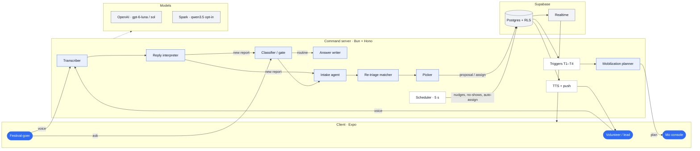
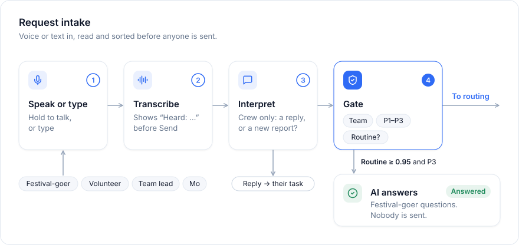
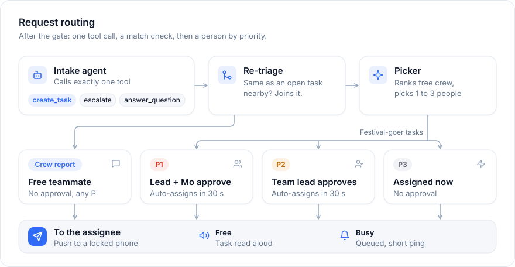
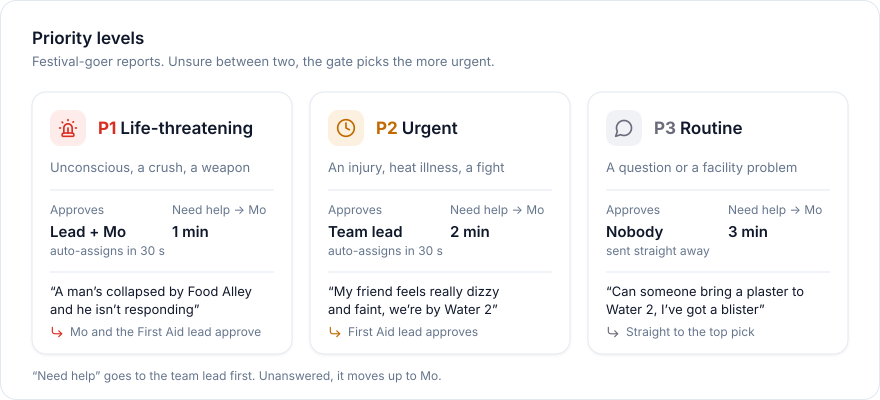
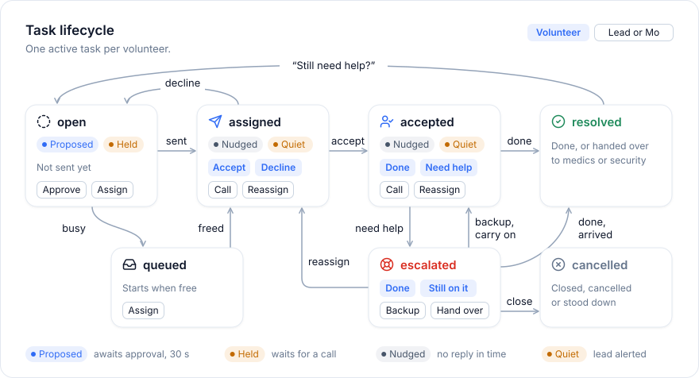
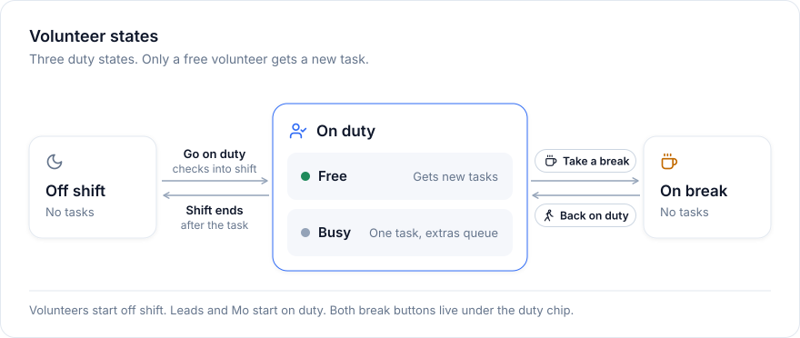
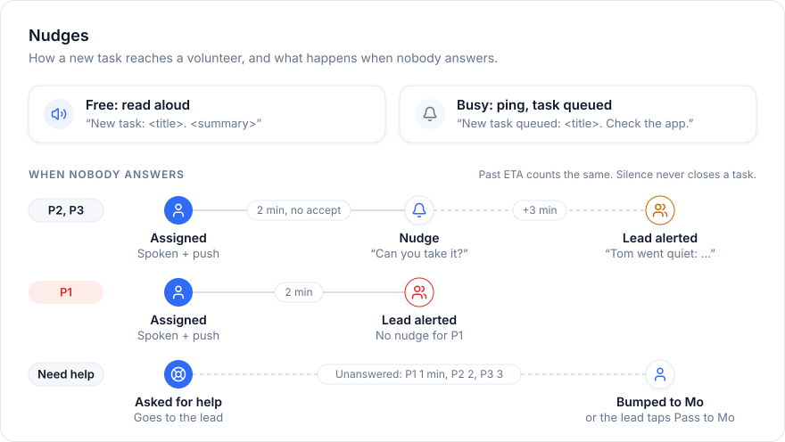
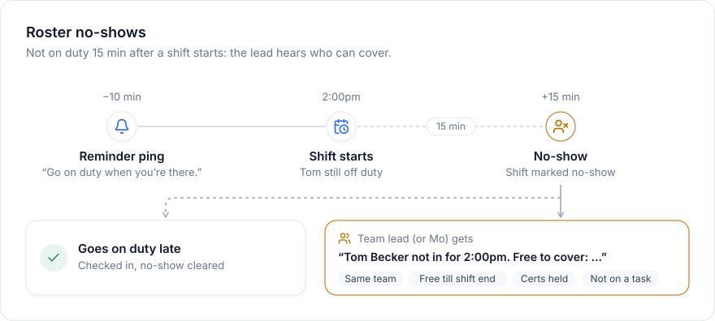
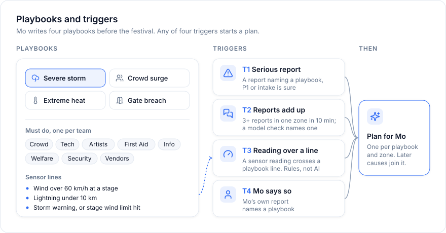
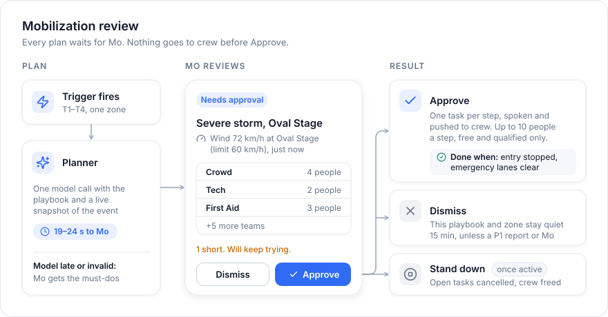

# moloop

**Everyone in the loop.** AI coordination for volunteers at a 15,000-person music festival.

Anyone reports by voice or text. Models turn it into a task, the right volunteer gets it, nothing goes silent. Expo (iOS, Android, web) + Supabase + one Bun command server.

| Role | Gets |
|---|---|
| **Mo** (coordinator) | Console: Needs action, Tasks, Crew, Map. Approves P1s and mobilizations. |
| **Team leads** | Approve P1/P2 picks for their team, answer "need help", reassign. |
| **Volunteers** | One task at a time, spoken aloud. Accept, Done, Need help, Take a break. |
| **Festival-goers** | Ask or report without an account. See who is coming and when. |

## Agent architecture

All model calls run on the command server. Phones read Supabase directly (RLS + Realtime); every write goes through the server.



`decide` = typed decision with probabilities (OpenAI Decisions API; Spark first when `MODEL_PROVIDER=spark`, OpenAI after 4 s).

| Agent | Job | Model |
|---|---|---|
| Transcriber | Hold-to-talk audio → text, "Heard: …" | gpt-4o-mini-transcribe |
| Classifier / gate | Team (1 of 8), P1/P2/P3, routine? | `decide` |
| Answer writer | Answers routine guest questions in their language | gpt-6-luna |
| Intake agent | Calls one tool: `create_task`, `escalate`, `answer_question` | gpt-6-luna tools |
| Re-triage matcher | Is this about an open task nearby? Worse? | `decide` |
| Reply interpreter | Accept / decline / done / need help / new report | `decide` |
| Detail reader | Guest's "What's changed?" → worse or not | `decide` |
| Picker | Re-ranks free crew, picks 1–3 people | `decide` (OpenAI) |
| Respond-by-voice | Lead's spoken call on an escalation | `decide` |
| Pile-up checker | 3+ reports in a zone → playbook or none | gpt-6-luna |
| Mobilization planner | One playbook + live snapshot → crew plan | gpt-6-sol, `/responses` |
| TTS briefs | Spoken messages → mp3 | gpt-4o-mini-tts |

Rules, not models: scheduler, rule ranker (team → free → skill → nearest), sensor triggers, push.

## How a request works





- **Gate at 0.95:** the only value in a 336-case eval where nothing that needs a person got through.
- **Priority merge:** agent P1 always wins; low classifier confidence rounds up.
- **Crew reports** skip approval and go to the first free teammate.
- **Fails closed:** both providers down → a person gets it at P2. The AI never answers.

## Priority, classification and routing



| Request | Class | Route |
|---|---|---|
| "Where are the nearest toilets to the Oval Stage?" | info · routine | AI answers, nobody sent |
| "Can someone bring a plaster to Water 2, I've got a blister" | first-aid · P3 | Straight to top pick |
| "My friend feels really dizzy and faint, we're by Water 2" | first-aid · P2 | Jordan (lead) approves |
| "A man's collapsed by Food Alley and he isn't responding" | first-aid · P1 | Mo + Jordan approve |
| "I want a refund, the headliner cancelled" | info · P3 · escalate | Held for the lead |
| "I overheard someone saying there is a bomb at the main stage" | security · P1 · escalate | Mo decides; help still goes |
| "She's fainted, she's on the ground now" (follow-up) | worse | P2 → P1, lead alerted |

## Task lifecycle



Every change is logged in `task_events`, every model decision in `triage_runs`.

## Keeping volunteers in check







- Free = on duty, in shift, qualified, not busy. One active task each; extras queue.
- Silence never closes a task.
- No-shows are not auto-reassigned: the lead gets "<Name> not in for <time>. Free to cover: …".

## SOPs → mobilization





- Four playbooks, fixed in code: storm, crowd crush, heat + water shortage, gate breach. Each has one must action per team.
- One plan per playbook + zone; new triggers join as causes.
- Planner fails or is slow → the plan comes straight from the playbook's actions.

## Demo simulator

`npm run simulate` drives the real server as sensors and people. Default `storm`: Oval Stage wind climbs 35 → 45 → 55 km/h, two volunteers report it, wind hits 72 km/h, Mo gets a plan. Flags: `--fast`, `--crew-replies`. Also: `triggers`, `examples`, `no-show`.

## Run it locally

<details>
<summary>Prerequisites, commands, env vars</summary>

Needs Node, Bun, Docker, the Supabase CLI, and Xcode or Android Studio. MapLibre and the BLE beacon module need a dev build; Expo Go won't work.

```bash
npm install
node scripts/ensure-supabase.mjs  # Docker, local Supabase, migrations, writes .env.local
# add OPENAI_API_KEY to .env.local (see .env.example)
npm run server                  # server on :8787
npm run web                     # Mo's console, http://localhost:8081
npm run ios                     # or: npm run android
npm run simulate                # storm at the Oval Stage
```

Reset data: `supabase db reset`. Checks: `npm test`, `npx tsc --noEmit`, `npm run lint`.

| Where | Env vars |
|---|---|
| Server | `SUPABASE_URL`, `SUPABASE_SECRET_KEY`, `DATABASE_URL`, `OPENAI_API_KEY` |
| Server, optional | `MODEL_PROVIDER`, `SPARK_BASE_URL`, `SPARK_API_KEY`, `MOBILIZATION_MODEL`, `SPEECH_BASE_URL`, `POLICY_SCALE`, `PORT` |
| App | `EXPO_PUBLIC_SUPABASE_URL`, `EXPO_PUBLIC_SUPABASE_PUBLISHABLE_KEY`, `EXPO_PUBLIC_SERVER_URL` (LAN address on a phone) |

</details>

## Repo map

```
src/app/            screens (Expo Router): (mo) (staff) (guest), approve, mobilize, respond
src/components/     UI, map
src/lib/            commands, lifecycle, ranking, roster, shifts
src/server/         command server: http, scheduler, triggers, pick, push
src/server/models/  interpreter, intake tools, providers, speech
src/server/predict/ mobilization planner
src/server/playbooks/ the four SOPs
supabase/           migrations, seed
scripts/            simulator, checks, evals, roster
modules/moloop-beacon/ BLE finder
```

More: [ARCHITECTURE](docs/ARCHITECTURE.md) (mobilization section predates code-defined playbooks) · [DEMO](docs/DEMO.md) · [PLAYTHROUGH](docs/PLAYTHROUGH.md) · [SCREENS](docs/SCREENS.md) · [MOBILIZATION-LATENCY](docs/MOBILIZATION-LATENCY.md)
