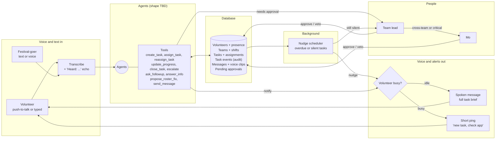
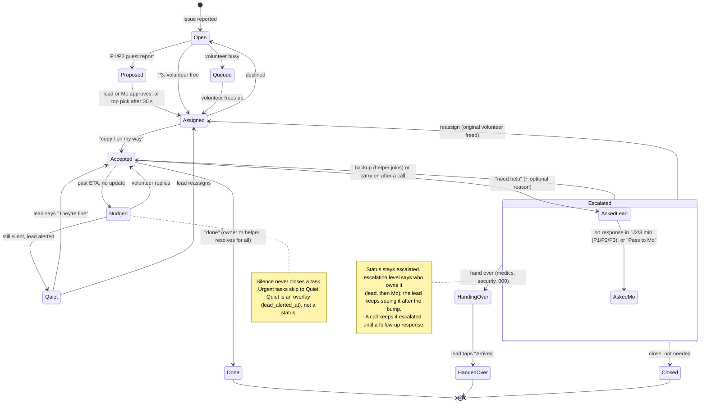

# Moloop architecture (brief)

AI coordination for Riverside volunteers. Anyone reports by voice or text, agents turn it into tasks, the right volunteer gets it, and nobody's task goes silent. Agent shape (one supervisor vs many specialists) is undecided; this doc fixes the **tools, data and rules** they work with.

## System

## Task lifecycle

Statuses are the eight in `enums.ts`; `in_progress` is unused (there is no "arrived" reply). Proposed, Nudged, Quiet, AskedLead/AskedMo and HandingOver are overlays on a status (`proposals`, `nudge_count`, `lead_alerted_at`, `escalation`). Done, HandedOver and Closed are `resolved`/`cancelled` with `resolution` set. Status copy for every screen comes from `src/lib/status.ts`.

## Tools (draft)

| Tool | Does | Human approval? |
| --- | --- | --- |
| `create_task` | Turn a report into a task: title, summary, team, priority, location | No |
| `assign_task` | Pick a volunteer (on shift, skills, nearest, least busy) or queue it | No, lead can veto |
| `reassign_task` | Move a task to someone else (declined, silent, overloaded) | Lead |
| `update_progress` | Record "copy", "on my way", "arrived", "delayed" | No |
| `close_task` | Mark done, log outcome | No |
| `escalate` | Push to team lead, then Mo | No (it only adds humans) |
| `ask_followup` | Ask the reporter or volunteer a short clarifying question | No |
| `answer_info` | Answer routine questions (toilets, times, directions) | No |
| `propose_roster_fix` | Cover no-shows, swaps, short staffing | Lead or Mo |
| `send_message` | Message a person, team or zone | Broadcasts need Mo |

Always human-only: emergency services, stage hold or evacuation, moving whole teams.

## Rules

**Voice in.** Push-to-talk (or typed). Audio is transcribed server-side, the text is echoed back ("Heard: ...") before anything happens. Short reply words are understood hands-free: *copy, on my way, done, need help*.

**Voice out.** Idle volunteers get the full task spoken. Busy volunteers (an Accepted or InProgress task) get a short ping: "new task, check the app". No acknowledgement means push again, then the team lead.

**Assignment.** One active task per volunteer; extra tasks queue. Respects shift, skills, distance and current load.

**Nudges.** A scheduler, not an LLM, checks for tasks past their ETA or silent too long: nudge, second nudge, alert lead, lead reassigns. Silence never closes a task. Urgent tasks go straight to the lead.

**Audit.** Every state change and agent decision is written to task events.

## Open

- Agent shape: one supervisor with tools vs a router plus specialist agents.
- Nudge timings (first nudge, gap, urgent skip).
- Team taxonomy: Artist, Food Vendor, Technical, Security, Logistics, Medical, Audience, Misc.
