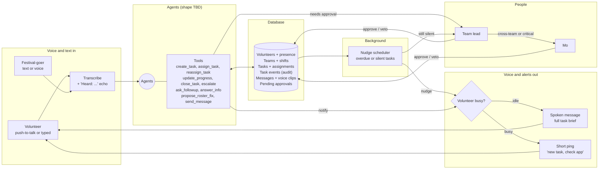

# Moloop architecture (brief)

AI coordination for Riverside volunteers. Anyone reports by voice or text, agents turn it into tasks, the right volunteer gets it, and nobody's task goes silent. Agent shape (one supervisor vs many specialists) is undecided; this doc fixes the **tools, data and rules** they work with.

## System

## Task lifecycle

Statuses are the eight in `enums.ts`; `in_progress` is unused (there is no "arrived" reply). Proposed, Nudged, Quiet, AskedLead/AskedMo and HandingOver are overlays on a status (`proposals`, `nudge_count`, `lead_alerted_at`, `escalation`). Done, HandedOver and Closed are `resolved`/`cancelled` with `resolution` set. Status copy for every screen comes from `src/lib/status.ts`.

## Tools (draft)

| Tool                 | Does                                                                 | Human approval?          |
| -------------------- | -------------------------------------------------------------------- | ------------------------ |
| `create_task`        | Turn a report into a task: title, summary, team, priority, location  | No                       |
| `assign_task`        | Pick a volunteer (on shift, skills, nearest, least busy) or queue it | No, lead can veto        |
| `reassign_task`      | Move a task to someone else (declined, silent, overloaded)           | Lead                     |
| `update_progress`    | Record "copy", "on my way", "arrived", "delayed"                     | No                       |
| `close_task`         | Mark done, log outcome                                               | No                       |
| `escalate`           | Push to team lead, then Mo                                           | No (it only adds humans) |
| `ask_followup`       | Ask the reporter or volunteer a short clarifying question            | No                       |
| `answer_info`        | Answer routine questions (toilets, times, directions)                | No                       |
| `propose_roster_fix` | Cover no-shows, swaps, short staffing                                | Lead or Mo               |
| `send_message`       | Message a person, team or zone                                       | Broadcasts need Mo       |

Always human-only: emergency services, stage hold or evacuation, moving whole teams.

## Mobilization simulation

Mo's Test situation workflow is separate from incident intake and the nudge scheduler. There is no
background automatic Mobilization detector. A simulation captures one immutable database/scenario
snapshot, then uses the configured model (currently `gpt-6-luna`, reasoning `medium`) through Responses:

1. Read the ten published SOPs' routing index: exact version, title and `appliesWhen`.
2. Call **read-only** `get_playbooks` once with a batch of SOP version keys relevant to observed or
   plausible trigger clues. Unknown unrelated sensors are not activation clues. Full rules come only
   from the captured published snapshot; the tool cannot write, approve, create tasks or dispatch.
3. Return strict, concise JSON. The model still supplies findings, uncertainty, causal hypotheses,
   all SOP verdicts, task instructions, headcounts and completion criteria. The server supplies exact
   missing-required-input lists; evidence references are restricted to the captured evidence IDs.
4. Validate JSON, evidence/location/team relationships, retrieved SOP versions and complete must-action
   accounting. A relevant `insufficient_data` SOP still needs every must action fully proposed or
   explicitly unmet; independent preparation tasks with empty refs cannot hide blocked SOP work.
5. Commit pending Mobilizations and the completed analysis audit atomically. Mo approval is separate;
   no formal response tasks are dispatched by analysis. Crew/skills/availability are rechecked by the server.

`not_applicable` means this input does not warrant activating that SOP, **not** that the hazard is absent.
`insufficient_data` means a relevant trigger exists but critical facts are missing. A task's `playbookRefs`
claims full proposed action coverage, not mere inspiration or partial preparation. Medical diagnosis,
unapproved water/shelters/emergency routes and invented observations remain forbidden. References alone
cannot prove the free-text action is operationally complete; Mo must review it.

Activation conditions in `appliesWhen` are not optional merely because they are absent from
`requiredInputs`. An unknown event-specific threshold must remain a contextual gap, not an assumed
activation. Unknown approved destinations/routes, drafts not yet planned for publication and omitted
parts of a source action cannot count as full proposed SOP coverage. Prompt instructions enforce this
distinction at the model level; the deterministic validator checks declared required inputs and action
accounting, but cannot prove arbitrary natural-language activation or action fidelity. A passing run is
not a certification of cause, complete SOP execution, available staffing or permission to dispatch.

Full input snapshots, exact projected prompts, both Responses envelopes and the tool request/result are
saved in `mobilization_runs`. `store:false` keeps API response storage disabled; opaque reasoning items
are replayed within the two-round call. No automatic model repair reruns occur in this workflow; schema
or semantic failures create no Mobilizations, and Retry analysis is a deliberate new audited run.

Active system prompt: `src/server/predict/prompts/mobilization-tools.ts` (versioned per run). Mo manages
SOPs through `/playbooks`; only published versions are available. `LLM_BASE_URL` must support `/responses`
reasoning/tools, with a server-only key and `LLM_MODEL` / `LLM_REASONING_EFFORT`. Other model workloads
retain their existing seams. The 30-second target is measured end-to-end, not enforced by truncating or
skipping safety checks; provider latency and reasoning time can exceed it.

## Rules

**Voice in.** Push-to-talk (or typed). Audio is transcribed server-side, the text is echoed back ("Heard: ...") before anything happens. Short reply words are understood hands-free: _copy, on my way, done, need help_.

**Voice out.** Idle volunteers get the full task spoken. Busy volunteers (an Accepted or InProgress task) get a short ping: "new task, check the app". No acknowledgement means push again, then the team lead.

**Assignment.** One active task per volunteer; extra tasks queue. Respects shift, skills, distance and current load.

**Nudges.** A scheduler, not an LLM, checks for tasks past their ETA or silent too long: nudge, second nudge, alert lead, lead reassigns. Silence never closes a task. Urgent tasks go straight to the lead.

**Audit.** Every state change and agent decision is written to task events.

## Open

- Agent shape: one supervisor with tools vs a router plus specialist agents.
- Nudge timings (first nudge, gap, urgent skip).
- Team taxonomy: Artist, Food Vendor, Technical, Security, Logistics, Medical, Audience, Misc.
