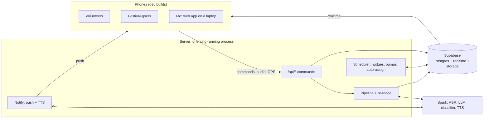

# Going live: plan for the University Oval field test

The promo video is a real field test on the UniMelb University Oval and athletics track. It uses real phones, live GPS, and people talking into the mic. Spark transcribes what they say, the AI triages, assigns and re-triages as it happens, and Mo coordinates from a shed. We film from the volunteer side and the festival-goer side. Demo day runs in a hall, where the same backend is driven by simulated people (phase 8).

Everything below is the gap between today and that video. The site plan is already on the oval and track (`src/data/venue.ts`), with Gate A at the Tin Alley tunnel and Gate B between the two sports centres.

## Where we are

| Piece | Today | Needed |
| --- | --- | --- |
| State | `MockRepo`: each phone keeps its own in-memory world and runs its own scheduler | One shared world in Supabase, pushed to every phone over realtime |
| Lifecycle | Pure functions in `src/lib/lifecycle.ts`, driven by `MockRepo` | The same functions, driven by one server |
| Pipeline | `src/server/pipeline`: route → triage → assign, each report handled once | The same pipeline plus re-triage of follow-ups, writing to Supabase |
| Models | `MockClassifier` / `MockLlm` keyword heuristics; `JevClassifier` and `LunaLlm` are stubs | Spark: `qwen3.5:4b` for chat and typed decisions, `qwen3-asr` for speech-to-text, `qwen3-tts` for text-to-speech |
| Voice | `useSimulatedTranscript` plays a script | Mic → Spark ASR → "Heard: …" → interpret |
| Location | Volunteers sit at their zone's node | GPS stream → presence → map, routes and assignment distance |
| Alerts | In-app messages only | Push notification when the phone is locked; spoken brief when the app is open |
| Schema | `supabase/migrations/…_init.sql` covers reports, tasks, assignments, events, messages | Add guest requests, presence, escalation and helpers on tasks |
| Devices | iOS simulator dev build | A dev build on every phone in the shoot |

## Shape

**Rule: phones read straight from Supabase and every write goes through the server.** All transitions pass through `lifecycle.ts` in one place. So there are no races between phones, there is one scheduler, and the model keys never reach a phone. GPS is the one exception: phones write their own presence row directly, because it's high-volume and has no logic.

**The server is one long-running Hono app on Bun, run on the Spark box** (`src/server/main.ts`, `npm run server`). Serverless hosting can't run a scheduler that ticks every few seconds. The models live on the Spark box, and its Tailscale URL is already reachable from anywhere, so phones on mobile data can get to it. Hono serves `/api/*` (`src/server/http/app.ts`), imports `src/server` directly, and the scheduler loop runs in the same process. Every `/api/*` call needs a Supabase session: `requireCaller` verifies the JWT and takes the role from `profiles`, never from the request body.

## Phases

Phases are in dependency order. 1 → 2 → 3 is the critical path. 4, 5 and 6 can run in parallel once 2 lands.

### 1. Supabase as the shared world

- Local: `supabase start`, then `.env.local` from `supabase status -o env` (see `.env.example`). Hosted: create the project, `supabase link`, `supabase db push`, and `bun scripts/seed.ts` with the hosted keys.
- Local Supabase runs on Docker. Apple `container` needs the socktainer Docker-API shim, which can't yet bring up a full Supabase stack reliably, so stay on Docker (or OrbStack) for now.
- Migration 2, adding what the domain types already have but the schema lacks:
  - `tasks`: `escalation jsonb`, `helper_ids uuid[]`, `resolution`, `request_id`
  - `guest_requests`: the `GuestRequest` type, with `thread jsonb` and stage
  - `presence`: one row per person with `lat`, `lng`, `accuracy`, `heading`, `at`, upserted and published to realtime
  - Proposals map to `task_assignments(status = proposed)` plus `agent_actions`, as `store.ts` already assumes. Add `auto_assign_at`.
- Seed the festival zones with real `lat`/`lng` from `toLngLat`, the teams and skills, and the field-test people with their real names and roles.
- **Auth:**
  - Crew: email OTP, with accounts pre-created by the seed.
  - Festival-goers: anonymous sign-in.
  - Tighten RLS so it matches what each screen reads.

**Done when:** `supabase db reset && npm run db:seed` gives a working festival world, and `npm run db:check` passes (a signed-in volunteer reads their own tasks, a festival-goer only their own request and who is coming).

**Status:** done locally. Migration `…_shared_world.sql`, `scripts/seed.ts` (zone coordinates from the site plan, crew from `supabase/crew.json`), `scripts/check-rls.ts`. The real cast goes in `supabase/crew.json` (gitignored; copy `crew.example.json`). Phone numbers and push tokens live in `profile_private`, which crew can read and festival-goers can't.

### 2. `SupabaseRepo` and the server

- `src/data/supabase-repo.ts` implements `Repo`:
  - hydrate a `Snapshot` from queries, then apply realtime changes to it
  - every command POSTs to `/api/*`
  - optimistic updates only where the UI already shows them
- **Server, command routes:** one route per `Repo` command (`reply`, `respond`, `assign`, `approve`, `guestAsk`, …). Each one loads the task, runs the matching `lifecycle.ts` function, and writes the task plus its `task_events` in one transaction.
- Port `MockRepo`'s behaviour, not its code. It's the spec for what each command does. Anything it does outside `lifecycle.ts` moves into shared functions, so the server and the demo-day simulator both use them.
- **Server, scheduler:** every 5 s, run `tick()` over active tasks and `proposalDue()` over pending proposals, and write any changes.
- Make `createRepo()` in `src/data/provider.tsx` pick `SupabaseRepo` when `EXPO_PUBLIC_SUPABASE_URL` is set. The dev panel keeps working against the mock only.

**Done when:** two phones signed in as a volunteer and a lead see the same task change state within a second, and a silent task nudges once, not once per phone.

### 3. Real models on Spark

- One OpenAI-compatible client against the Spark base URL, with the key in the server's env only.
- `LunaLlm.generate`:
  - chat completions with JSON-schema output
  - one repair retry on a zod failure
  - after that, fail closed to a human (the API route already returns `pipeline_failed`)
- `JevClassifier.classify`: `/v1/systemone` with the label set. Confirm the request and response contract against `docs/local-llm-api-docs.md`, since the stub's contract is assumed.
- `Repo.interpret` moves server-side. The classifier decides whether the words are a reply to my task or a new report, so "Heard: on my way" becomes `accept` on the current task.
- Localise the reporter reply (the TODO in `pipeline/index.ts`).
- Set a latency budget and measure it on the oval over 4G: from letting go of the pill to "Heard" in under 1.5 s, and from send to the task on the lead's screen in under 4 s.

**Done when:** typed reports go through the live models end to end, and `triage_runs` shows the model ids and latencies.

### 4. Voice in and out

- **In:**
  - record with `expo-audio` while the pill is held
  - POST the clip to the server's `/api/transcribe`, which forwards it to Spark ASR
  - the result replaces `useSimulatedTranscript`
  - store the clip in Supabase Storage as `reports.media_url`
- **Out:**
  - the server renders the spoken brief through Spark TTS and stores it
  - the phone plays it with `expo-audio` when the app is open
  - the lock-screen push carries the short text
- Give the "Heard: …" check the same treatment for festival-goers.
- Earbuds or bone-conduction headsets for volunteers on the day. Phone speakers on an open oval are hard to hear and hard to film.

**Done when:** someone holds the pill, says "there's a guy who's collapsed by the food stalls", and a P1 proposal appears on Mo's screen.

### 5. Live location

- Add `expo-location` with `npx expo install`, plus the permission strings in `app.json`. It needs a rebuild.
- **Foreground:** `watchPositionAsync`, sending an upsert at most every 3 s, or after 5 m of movement.
- **Background:** volunteers walk with the phone in a pocket, so add `expo-task-manager` and "Always" permission on iOS. If that fights us, the fallback is to keep the app open with the screen awake while on task.
- **Using the position:**
  - `toPlan()` converts it to plan metres
  - snap it to the nearest walk-graph node for routing
  - a person's dot comes from presence, falling back to their zone
- Assignment uses real walking distance from presence (`store.findCandidates`).
- A volunteer's route recomputes as they move, and the festival-goer sees help actually closing in.
- Mark presence stale after 60 s without an update, so the map greys the dot instead of lying.

**Done when:** walking the site moves your dot on Mo's map and shortens the route on the reporter's phone.

### 6. Re-triage: the part that should look smartest on camera

When a new report or volunteer note comes in, the server checks it against open tasks in the same or adjacent zones from the last 20 minutes before creating anything:

1. The LLM gets the new text plus 1 to 5 candidate tasks, and answers whether it's a new incident or an update to one of them.
2. If it's an update:
   - append it to the task's thread and events
   - re-run priority and team on the combined account
3. If the priority goes up (for example "he's stopped responding" on a P2):
   - update the task
   - alert the lead
   - propose backup or a skill-matched swap through the normal proposal path (lead or Mo approves)
   - the assignee gets a spoken "Update: …"
4. If the priority goes down or the problem is resolved ("his mate found him"), offer close or downgrade instead of doing it silently. Silence never closes a task.

The mock's `guestAddDetail` is the single-request version of this. It generalises to any report, from anyone.

**Done when:** a second, independent report about the same person upgrades the existing task instead of creating a duplicate, and the volunteer already on the way hears the update.

### 7. Getting it onto the phones

- **iOS:**
  - Apple Developer account
  - register every iPhone's UDID
  - `eas build --profile development` (ad hoc)
  - set a real bundle id in `app.json` (it's `com.anonymous.moloop` now)
- **Android:** a development APK, sideloaded.
- **Push:** `expo-notifications`, with an APNs key through EAS credentials. Save the push token to `profile_private.push_token` at sign-in.
- **Mo's console:** the web build on a laptop. Check that the lead and Mo screens work at laptop width, and on whatever connection the shed has.
- **Before the shoot:** an EAS Update channel, so fixes on the day don't need a rebuild.

**Done when:** every shoot phone opens the app, signs in, and receives a test push while locked.

### 8. Demo-day simulator (after the video)

A script that drives the real server with simulated people:

- Fake volunteers walk the walk graph and post presence via `toLngLat`.
- Recorded voice clips from the field test are replayed as reports on a timeline.
- Fake replies come in where needed.

The hall demo then runs the real pipeline, real triage and the real scheduler, with nothing mocked in the app. It replaces the dev panel's scenarios for anything shown on stage.

## Field test

- **Dry run:** three people on the oval a few days before, running every scenario once. Write down what lagged or broke.
- **Cast:**
  - Mo in the shed
  - one lead
  - three or four volunteers across teams
  - two festival-goers with their own phones
  - one camera per perspective
- **Script beats** (each one shows a real system behaviour):
  1. A festival-goer's question gets answered by the AI.
  2. A P2 report gets a proposal, Mo approves it, and the volunteer walks there while the festival-goer watches them approach.
  3. A second report about the same person upgrades it to P1: backup is proposed and the update is spoken.
  4. A volunteer asks for help, and it escalates to the lead, then to Mo.
  5. A volunteer goes quiet and gets nudged.
- **On the day:**
  - The server logs every model call (`triage_runs`), so a weird take can be explained or re-shot.
  - Screen-record every phone, and start each take with a clap for sync.
  - Bring battery packs. GPS, the screen and audio drain a phone in two to three hours.

## Decisions needed

- Which phones are in the shoot, and how many are iPhones? This decides the Apple account timeline.
- The shoot date. That sets how much of phases 4–6 is in scope.
- A Supabase project and a Spark API key.
- Whether the server runs on the Spark box (recommended) or on a laptop on the day.
