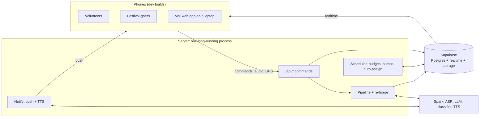

# Going live: plan for the University Oval field test

The promo video is a real field test on the UniMelb University Oval and athletics track. It uses real phones, live GPS, and people talking into the mic. Spark transcribes what they say, the AI triages, assigns and re-triages as it happens, and Mo coordinates from a shed. We film from the volunteer side and the festival-goer side. Demo day runs in a hall, where the same backend is driven by simulated people (phase 8).

Everything below is the gap between today and that video. The site plan is already on the oval and track (`src/data/venue.ts`), with Gate A at the Tin Alley tunnel and Gate B between the two sports centres.

## Where we are

| Piece | Today | Needed |
| --- | --- | --- |
| State | `MockRepo`: each phone keeps its own in-memory world and runs its own scheduler | One shared world in Supabase, pushed to every phone over realtime |
| Lifecycle | Pure functions in `src/lib/lifecycle.ts`, driven by `MockRepo` | The same functions, driven by one server |
| Pipeline | `src/server/pipeline`: route → triage → assign, each report handled once | The same pipeline plus re-triage of follow-ups, writing to Supabase |
| Models | Keyword stand-ins by default; with `USE_LIVE_MODELS=1`, OpenAI (GPT-6 Luna for typed decisions and chat) decides everything the server decides, or the Spark first with `MODEL_PROVIDER=spark` | Add Spark `qwen3-asr` for speech-to-text and `qwen3-tts` for text-to-speech (phase 4) |
| Voice | Hold the pill → `expo-audio` → `/api/transcribe` → Qwen3-ASR → "Heard: …"; spoken briefs through Qwen3-TTS (phase 4) | Spark reachable on the day |
| Location | Volunteers sit at their zone's node | GPS stream → presence → map, routes and assignment distance |
| Alerts | In-app messages only | Push notification when the phone is locked; spoken brief when the app is open |
| Schema | `supabase/migrations/…_init.sql` covers reports, tasks, assignments, events, messages | Add guest requests, presence, escalation and helpers on tasks |
| Devices | iOS simulator dev build | A dev build on every phone in the shoot |

## Shape

**Rule: phones read straight from Supabase and every write goes through the server.** All transitions pass through `lifecycle.ts` in one place. So there are no races between phones, there is one scheduler, and the model keys never reach a phone. GPS is the one exception: phones write their own presence row directly, because it's high-volume and has no logic.

**The server is one long-running Hono app on Bun, run on the Spark box** (`src/server/main.ts`, `npm run server`). Serverless hosting can't run a scheduler that ticks every few seconds. The models live on the Spark box, and its Tailscale URL is already reachable from anywhere, so phones on mobile data can get to it. Hono serves `/api/*` (`src/server/http/app.ts`), imports `src/server` directly, and the scheduler loop runs in the same process. Every `/api/*` call needs a Supabase session: `requireCaller` verifies the JWT and takes the role from `profiles`, never from the request body.

## Phases

Phases are in dependency order. 1 → 2 → 3 is the critical path. 4, 5 and 6 can run in parallel once 2 lands.

### 1. Supabase as the shared world

- Local: `supabase start`, then `.env.local` from `supabase status -o env` (see `.env.example`). Hosted: create the project, `supabase link`, `supabase db push`, and `bun scripts/seed.ts` with the hosted keys.
- Local Supabase runs on Docker. Apple `container` needs the socktainer Docker-API shim, which can't yet bring up a full Supabase stack reliably, so stay on Docker (or OrbStack) for now.
- Migration 2, adding what the domain types already have but the schema lacks:
  - `tasks`: `escalation jsonb`, `helper_ids uuid[]`, `resolution`, `request_id`
  - `guest_requests`: the `GuestRequest` type, with `thread jsonb` and stage
  - `presence`: one row per person with `lat`, `lng`, `accuracy`, `heading`, `at`, upserted and published to realtime
  - Proposals map to `task_assignments(status = proposed)` plus `agent_actions`, as `store.ts` already assumes. Add `auto_assign_at`.
- Seed the festival zones with real `lat`/`lng` from `toLngLat`, the teams and skills, and the field-test people with their real names and roles.
- **Auth:**
  - Crew: email OTP, with accounts pre-created by the seed.
  - Festival-goers: anonymous sign-in.
  - Tighten RLS so it matches what each screen reads.

**Done when:** `supabase db reset && npm run db:seed` gives a working festival world, and `npm run db:check` passes (a signed-in volunteer reads their own tasks, a festival-goer only their own request and who is coming).

**Status:** done locally. Migration `…_shared_world.sql`, `scripts/seed.ts` (zone coordinates from the site plan, crew from `supabase/crew.json`), `scripts/check-rls.ts`. The real cast goes in `supabase/crew.json` (gitignored; copy `crew.example.json`). Phone numbers and push tokens live in `profile_private`, which crew can read and festival-goers can't.

### 2. `SupabaseRepo` and the server

- `src/data/supabase-repo.ts` implements `Repo`:
  - hydrate a `Snapshot` from queries, then apply realtime changes to it
  - every command POSTs to `/api/*`
  - optimistic updates only where the UI already shows them
- **Server, command routes:** one route per `Repo` command (`reply`, `respond`, `assign`, `approve`, `guestAsk`, …). Each one loads the task, runs the matching `lifecycle.ts` function, and writes the task plus its `task_events` in one transaction.
- Port `MockRepo`'s behaviour, not its code. It's the spec for what each command does. Anything it does outside `lifecycle.ts` moves into shared functions, so the server and the demo-day simulator both use them.
- **Server, scheduler:** every 5 s, run `tick()` over active tasks and `proposalDue()` over pending proposals, and write any changes.
- Make `createRepo()` in `src/data/provider.tsx` pick `SupabaseRepo` when `EXPO_PUBLIC_REPO=supabase` (explicit: `.env.local` always sets the Supabase URL). The dev panel keeps working against the mock only.

**Status, client side:** done locally. `src/data/supabase-repo.ts` with the row mappers in `src/data/supabase/rows.ts`, sign-in at `src/app/sign-in.tsx` (crew by email code, festival-goers anonymous), and `npm run repo:check` (real sessions, realtime timings, the command contract against a stub server). The `/api/*` command routes are the server's half.

**Done when:** two phones signed in as a volunteer and a lead see the same task change state within a second, and a silent task nudges once, not once per phone.

**Status, server side:** done locally.

- **Shared commands:** everything `MockRepo` did outside `lifecycle.ts` is now in `src/lib/commands.ts`: pure functions over a `Batch` (`src/lib/batch.ts`). `MockRepo`, the server and the simulator all run them. The mock behaves exactly as before.
- **Routes:** `POST /api/<repoMethod>` for every command (`src/server/http/commands.ts`). The body is the named args, and the answer is `{}` or the result. Errors are `{ error }` with 400, 401, 403, 404 or 409.
  - Volunteers act only on tasks they're on.
  - Leads and Mo get the lead commands.
  - Festival-goers touch only their own requests.
- **Transactions:** each command runs in one Postgres transaction over `DATABASE_URL` (`src/server/world.ts`): lock, load, run, then write the task, events, messages, deliveries, proposals and requests.
  - The lock is one advisory lock for the whole world, because commands read across tasks (who's busy, what's queued next).
  - A festival's handful of writes a second fits through one lock easily.
- **Scheduler:** `schedulerStep` every 5 s in the same process (`src/server/scheduler.ts`), under the same lock. A tick that overlaps a command, or a second server, can't double a nudge.
- **Interpret:** still the keyword heuristic, behind one function (`src/server/interpret.ts`) for phase 3 to swap.
- **Rows:** the server reads with the phones' mappers (`src/data/supabase/rows.ts`) and writes with `src/server/rows.ts`.
  - One `messages` row per recipient, so a message id is unique per person.
  - Every new task gets a `reports` row.
  - Everyone placed on a task keeps a `task_assignments` row that follows them (notified, accepted, done), and it turns `reassigned` when the task moves off them. That row is how their phone still sees the change.
- **Timings:** `POLICY_SCALE`, `POLICY_*_MS` and `SCHEDULER_MS` in env shorten them for rehearsals and tests (`.env.example`).
- **Check:** `npm run commands:check`, against a server started with `POLICY_SCALE=0.05 POLICY_AUTO_ASSIGN_MS=3000 SCHEDULER_MS=500`. It brings its own throwaway crew and drives every flow over HTTP as real sessions, including a silent task raced by commands and a second scheduler: one nudge, one lead alert. Without the lock it gets six of each.
- **Not yet:** nothing. `/api/reports` and the old pipeline are gone: phase 3 folded their prompts into `src/server/models`.

### 3. Real models on Spark

- One OpenAI-compatible client against the Spark base URL, with the key in the server's env only.
- `LunaLlm.generate`:
  - chat completions with JSON-schema output
  - one repair retry on a zod failure
  - after that, fail closed to a human
- `JevClassifier.classify`: `/v1/systemone` with the label set. Confirm the request and response contract against `docs/local-llm-api-docs.md`, since the stub's contract is assumed.
- `Repo.interpret` moves server-side. The classifier decides whether the words are a reply to my task or a new report, so "Heard: on my way" becomes `accept` on the current task.
- Localise what the reporter hears back.
- Set a latency budget and measure it on the oval over 4G: from letting go of the pill to "Heard" in under 1.5 s, and from send to the task on the lead's screen in under 4 s.

**Done when:** typed reports go through the live models end to end, and `triage_runs` shows the model ids and latencies.

**Status:** done locally, on typed text. `USE_LIVE_MODELS=1` turns it on; keys are in the server's env only (`.env.example`).

- **Two models, one seam.** `src/server/models/interpreter.ts` is the only thing the server asks. `SparkInterpreter` and `KeywordInterpreter` both implement it, so the server runs with no keys and the same commands run either way.
  - **Typed decisions** (OpenAI `/v1/decisions` on `gpt-6-luna`, or Spark `/v1/systemone` with `MODEL_PROVIDER=spark`): team, priority, "is this only a routine question", "did the detail make it worse", and "is this utterance a reply to my task". About 0.2 s each on the Spark.
  - **Chat** (JSON-schema output, validated with zod, one repair retry): the English title and summary, category, zone, language, and the answer to a routine question in the asker's language, from the venue facts only. GPT-6 Luna on OpenAI (`gpt-6-luna`, reasoning off), or `qwen3.5:4b` on the Spark with `MODEL_PROVIDER=spark`. About 1 to 1.5 s.
  - **Fallback.** With `MODEL_PROVIDER=spark`, a Spark call that fails or runs late (5 s chat, 4 s decisions, 8 s ASR, 12 s TTS) is cancelled and OpenAI answers instead (`src/server/models/fallback.ts`). If both fail, the request goes to a person.
  - Chat and typed decisions run in parallel, and a model call never happens inside the world lock: the server asks first, then hands the answer to the pure command (`src/lib/ai.ts` is the shape).
- **Safety rules in code, not prompts.**
  - The AI answers only when the chat model and the classifier both say routine, the priority reads P3, and no red-flag word is in the text.
  - Words like "collapsed", "not breathing", "not moving" force P1 whatever a model says. A model that isn't sure of the priority rounds up.
  - If the classifier is down or fails, the request becomes a task for a person at P2 or above. If only the chat model fails, the classifier's priority stands, and the request still goes to a person. Either way it is never answered by the AI.
  - "Talk to a person" on an AI answer is P3, unless one of the rules above raises it.
- **`Repo.interpret` is server-side.** "Heard: on my way" becomes `accept` on the current task when the classifier is at least 0.6 sure, the utterance is 12 words or fewer, and a helper only ever gets `done`. Typically 0.2 to 0.25 s. If the classifier is less sure, or takes over `AI_INTERPRET_MS` (1.5 s, queue wait included), keywords answer instead.
- **Localised, in part.** The AI's answer comes back in the language written, and `reporter.language` is what the model detected, so assignment can prefer a volunteer who speaks it. Everything else a festival-goer reads is still in English.
- **Logged.** Every decision that makes or changes a task or a request writes a `triage_runs` row (model ids, team and priority with confidences, the rewrite, latency, error) on the task's report, or on the request when the AI answered. Migration `…_triage_runs_for_requests.sql`. `interpret` comes before any report exists, so it logs to the server console only.
- **Rate limits.** Spark allows 4 calls at once and 100 a minute per key. One queue in front of it (`SPARK_CONCURRENCY`, `SPARK_RPM`) lets a volunteer's utterance or report jump ahead of a festival-goer's request. A call that gives up while waiting leaves the queue without using a slot. A typed report costs two calls, so about 47 a minute is the ceiling on Spark. OpenAI has no such cap that we reach.
- **Stuck requests.** The scheduler picks up any request left at "Understanding" (a restart, a dead call). The sweep runs beside the scheduler passes, so a slow or dead model never holds up a nudge.
- **Checks.** `npm run models:check` runs 18 real utterances against the live models and prints latencies. `npm run commands:check` passes against both the keyword server and a `USE_LIVE_MODELS=1` server.
- **Not done:**
  - The latency budget over 4G on the oval. It needs phones and the Spark box, and the speech leg (phase 4) comes before "Heard".
  - Localising what festival-goers read besides the AI's answer.

### 4. Voice in and out

- **In:**
  - record with `expo-audio` while the pill is held
  - POST the clip to the server's `/api/transcribe`, which forwards it to Spark ASR
  - the result replaces `useSimulatedTranscript`
  - store the clip in Supabase Storage as `reports.media_url`
- **Out:**
  - the server renders the spoken brief through Spark TTS and stores it
  - the phone plays it with `expo-audio` when the app is open
  - the lock-screen push carries the short text
- Give the "Heard: …" check the same treatment for festival-goers.
- Earbuds or bone-conduction headsets for volunteers on the day. Phone speakers on an open oval are hard to hear and hard to film.

**Done when:** someone holds the pill, says "there's a guy who's collapsed by the food stalls", and a P1 proposal appears on Mo's screen.

**Status:** done locally, on the server and in the app build. Checked end to end with real speech by `npm run voice:check`, on the same Qwen3 models running on a Mac (Spark was unreachable that day).

- **In.**
  - Holding the pill records mono AAC at 16 kHz with `expo-audio` (`src/components/voice/use-hold-to-talk.ts`), about 8 KB a second. The waveform follows the real mic level.
  - Letting go POSTs the clip to `/api/transcribe` (multipart, any signed-in caller). The answer is `{ text, clip }`, and the "Heard" tray shows the text for every dock, festival-goers' included.
  - A tap shorter than 0.4 s, or a hold that never got louder than −45 dBFS, isn't sent: the recogniser invents words from silence.
  - The first hold asks for the microphone.
- **Clips are kept.**
  - Every clip goes in the private `voice` bucket at `<caller>/<clip>.<ext>`, uploaded alongside the transcription so it never delays "Heard".
  - A report made from speech lists its clips in `reports.voice_clips`, one per hold ("hold to add more" makes two). For festival-goers they go in `guest_requests.voice_clips` and are copied onto the report when a task is made.
  - The server only accepts your own clips. Migration `…_voice.sql`.
- **Vocabulary.** ASR gets a hint with the zone names and crew first names (`Tin Alley`, `Priya`).
- **Out.**
  - After a transaction commits, each spoken message (a new task when you're free, backup, next up) is rendered by TTS. It goes in the `speech` bucket at `<recipient>/<message>.mp3`, and `message_deliveries.audio_path` points at it.
  - The phone sees that update over realtime. If the app is open and the message is under 2 minutes old and unread, it plays (`use-spoken-briefs.ts`).
  - Holding the pill cuts a brief off; it starts again after "Heard". Only the recipient can read their own audio (storage RLS).
  - Briefs are on with `USE_LIVE_MODELS=1`.
- **Speech server.**
  - OpenAI by default (`gpt-4o-mini-transcribe`, `gpt-4o-mini-tts` with voice `marin`). With `MODEL_PROVIDER=spark`, Spark first, sharing its queue, then OpenAI.
  - `SPEECH_BASE_URL` puts any OpenAI-shaped server first, such as `mlx_audio.server` on a Mac with the same Qwen3-ASR 1.7B and Qwen3-TTS 1.7B weights (`.env.example`), with OpenAI behind it.
  - A local server loads the models at boot.
- **Measured** (M5 Max, local models, warm):

  | Step | Time |
  | --- | --- |
  | Transcribe a 3–5 s hold | 0.2–0.6 s |
  | Render a brief | about 2.4 s |
  | Approval → brief playable | 2.5 s |
- **Not done:**
  - The lock-screen push (phase 7).
  - The same measurements on Spark over 4G.
  - The mock can't hear: a hold there returns a canned line.

### 5. Live location

- Add `expo-location` with `npx expo install`, plus the permission strings in `app.json`. It needs a rebuild.
- **Foreground:** `watchPositionAsync`, sending an upsert at most every 3 s, or after 5 m of movement.
- **Background:** volunteers walk with the phone in a pocket, so add `expo-task-manager` and "Always" permission on iOS. If that fights us, the fallback is to keep the app open with the screen awake while on task.
- **Using the position:**
  - `toPlan()` converts it to plan metres
  - snap it to the nearest walk-graph node for routing
  - a person's dot comes from presence, falling back to their zone
- Assignment uses real walking distance from presence (`store.findCandidates`).
- A volunteer's route recomputes as they move, and the festival-goer sees help actually closing in.
- Mark presence stale after 60 s without an update, so the map greys the dot instead of lying.

**Done when:** walking the site moves your dot on Mo's map and shortens the route on the reporter's phone.

### 6. Re-triage: the part that should look smartest on camera

When a new report or volunteer note comes in, the server checks it against open tasks in the same or adjacent zones from the last 20 minutes before creating anything:

1. The LLM gets the new text plus 1 to 5 candidate tasks, and answers whether it's a new incident or an update to one of them.
2. If it's an update:
   - append it to the task's thread and events
   - re-run priority and team on the combined account
3. If the priority goes up (for example "he's stopped responding" on a P2):
   - update the task
   - alert the lead
   - propose backup or a skill-matched swap through the normal proposal path (lead or Mo approves)
   - the assignee gets a spoken "Update: …"
4. If the priority goes down or the problem is resolved ("his mate found him"), offer close or downgrade instead of doing it silently. Silence never closes a task.

The mock's `guestAddDetail` is the single-request version of this. It generalises to any report, from anyone.

**Done when:** a second, independent report about the same person upgrades the existing task instead of creating a duplicate, and the volunteer already on the way hears the update.

### 7. Getting it onto the phones

- **iOS:**
  - Apple Developer account
  - register every iPhone's UDID
  - `eas build --profile development` (ad hoc)
  - set a real bundle id in `app.json` (it's `com.anonymous.moloop` now)
- **Android:** a development APK, sideloaded.
- **Push:** `expo-notifications`, with an APNs key through EAS credentials. Save the push token to `profile_private.push_token` at sign-in.
- **Mo's console:** the web build on a laptop. Check that the lead and Mo screens work at laptop width, and on whatever connection the shed has.
- **Before the shoot:** an EAS Update channel, so fixes on the day don't need a rebuild.

**Done when:** every shoot phone opens the app, signs in, and receives a test push while locked.

### 8. Demo-day simulator (after the video)

A script that drives the real server with simulated people:

- Fake volunteers walk the walk graph and post presence via `toLngLat`.
- Recorded voice clips from the field test are replayed as reports on a timeline.
- Fake replies come in where needed.

The hall demo then runs the real pipeline, real triage and the real scheduler, with nothing mocked in the app. It replaces the dev panel's scenarios for anything shown on stage.

## Field test

- **Dry run:** three people on the oval a few days before, running every scenario once. Write down what lagged or broke.
- **Cast:**
  - Mo in the shed
  - one lead
  - three or four volunteers across teams
  - two festival-goers with their own phones
  - one camera per perspective
- **Script beats** (each one shows a real system behaviour):
  1. A festival-goer's question gets answered by the AI.
  2. A P2 report gets a proposal, Mo approves it, and the volunteer walks there while the festival-goer watches them approach.
  3. A second report about the same person upgrades it to P1: backup is proposed and the update is spoken.
  4. A volunteer asks for help, and it escalates to the lead, then to Mo.
  5. A volunteer goes quiet and gets nudged.
- **On the day:**
  - The server logs every model call (`triage_runs`), so a weird take can be explained or re-shot.
  - Screen-record every phone, and start each take with a clap for sync.
  - Bring battery packs. GPS, the screen and audio drain a phone in two to three hours.

## Decisions needed

- Which phones are in the shoot, and how many are iPhones? This decides the Apple account timeline.
- The shoot date. That sets how much of phases 4–6 is in scope.
- A Supabase project and a Spark API key.
- Whether the server runs on the Spark box (recommended) or on a laptop on the day.
